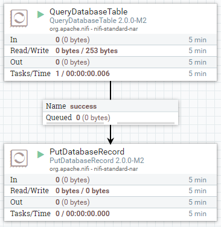
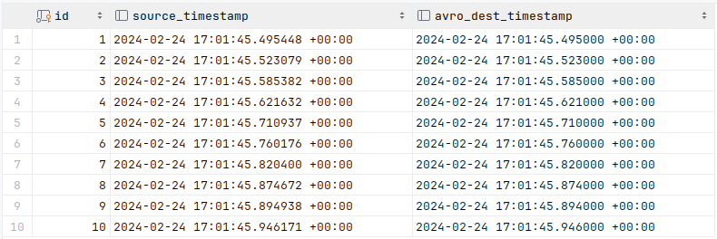
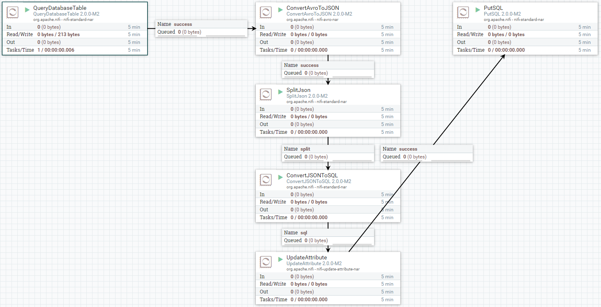
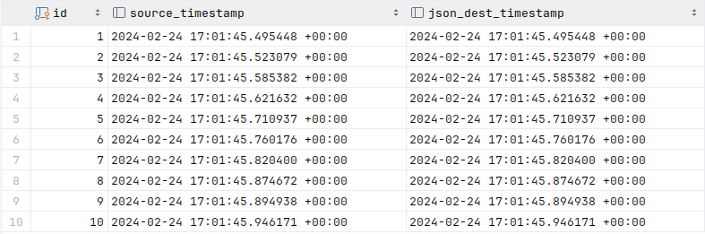
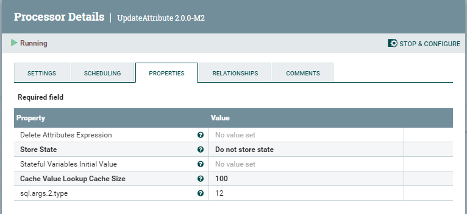

+++
author = "Steven C. Buttgereit"
title = "Preserving Database Timestamp Resolution in Apache NiFi"
date = "2024-02-25T00:00:00-08:00"
draft = false
description ="A method for avoiding timestamp data loss when transferring database data using Apache NiFi."
keywords = []
tags = []
type = "blog"
thumbnail = "/blog/nifi-timestamp-resolution/nifi-timestamp-resolution.png"
weight = 10
+++
Photo by <a href="https://unsplash.com/@jckbck?utm_content=creditCopyText&utm_medium=referral&utm_source=unsplash" target="_blank">Jakub Dziubak</a> on <a href="https://unsplash.com/photos/a-close-up-of-a-watch-face-with-numbers-on-it-usPWohZU_aI?utm_content=creditCopyText&utm_medium=referral&utm_source=unsplash" target="_blank">Unsplash</a>

Example code for this article is available from our [GitHub repository](https://github.com/MuseSystems/nifi_timestamp_resolution).

## Describing the Problem

Recently, while working on a client project which involved integrating data
from one database to another using Apache NiFi, we found that we had a data
loss problem.  The issue was that Apache NiFi was reading records including
timestamp data down to microseconds but was losing timestamp resolution,
truncating the timestamp data to millisecond granularity.  Our client
indicated to us that the microsecond level was material thus we had a problem
to solve.

To be fair, under most reasonable use cases, microsecond or better resolution
is usually not important... or even accurate enough to be "real".  However,
while the validity of sub-millisecond timings may well be questioned, it is
nonetheless not appropriate for the integration layer to silently transform
the source data into a form with less resolution.  It is completely possible
that the origin of the data was correctly resolved to sub-millisecond times
and that the microsecond or better resolution is materially important to the
data.

A hand-wavy explanation is that Apache NiFi, in its own internal
representation of correctly typed data, simply doesn't support greater than
millisecond timestamp resolution.  Fair enough.  Data type awareness in the
processing of data flows is overall a good thing and I'm glad that Apache NiFi
does this. Data transformations and translations between different sources and
sinks become more reliable and are usually easier to work with when the
integration layer has a stronger type awareness.

But this brings us to our second problem: Apache NiFi, in the pursuit of
providing users a simple to understand and configure experience, doesn't
provide well defined escape hatches from the back-box functionality that
are most out-of-box processors.  It seems as though, once you reach the point
where you need to go outside of the narrowly defined simple path, you need to
be prepared to make the leap to develop your own processor to accommodate your
needs.  You can be a simple analyst or a full-fledged developer, but there is
no middle ground to give a sufficiently advanced analyst a way to configure
themselves out of jams like the one we discuss here.  This is shame because it
seems like most processors could have some relatively simple modifications to
allow such advanced escape hatches, on an opt-in complexity basis, without
compromising the simple use case path to cover most use cases.  But I
digress...

## Demonstration of the Problem

Consider the following simple, naive workflow:

  1. We read the source data from a database table which includes very
     precise timestamp data. (`source_table`)

  2. We write that data to a destination database table which should retain
     the precision of timestamp data. (`avro_destination`)

If we perform this task using the most simple Apache NiFi technique for doing
so we end up with a simple flow definition that might look something like:



We use the `QueryDatabaseTable` processor to get our source table data and
`PutDatabaseRecord` processor to write the data to the destination table.  We
go ahead and use Avro Logical Data Types to preserve our typing data along the
way.

We run it and all works. Great!  Let's look at the data by running a query:

```sql
SELECT
    id
  , s.test_timestamp AS source_timestamp
  , d.test_timestamp AS avro_dest_timestamp
FROM source_table s JOIN avro_destination d USING ( id )
ORDER BY id
LIMIT 10;
```

And our result is:



Oh dear.  We've lost our microsecond data.  The naive, easy to implement
approach doesn't work if you need the full timestamp data of the source.

## Our Observations

When looking at the Data Provenance, we could see that the Avro Flow File
Content created by `QueryDatabaseTable` contained the full timestamp.  So the
issue wasn't that Apache NiFi wasn't reading the data in way it couldn't
succeed, but that in manipulating the data for writing, perhaps in converting
the Avro data to corresponding JDBC data types, we were losing the granularity.

We worked with various Apache NiFi team members via their [Slack instance](https://apachenifi.slack.com/)
to find the issue and work towards a solution.

>  Note that the Apache NiFi team on Slack were very helpful, patient with us,
>  and extremely sensitive to our needs.

The Apache NiFi team confirmed that internally they were limited to handling
timestamp data to the millisecond level.  While our issue seemed to prompt
additional thought and consideration to use cases like ours, it wasn't going
to solve our immediate problem.

## Devising A Workaround

Our strategy was to avoid the NiFi internal conversion of the timestamp data
by treating it as a string as much as possible.  This turned out to be more
difficult than expected because the NiFi processors, such as `PutDatabaseRecord`
are type aware based on introspection of the database schema.  This led to
either NiFi continuing to treat the data as timestamp data or database type
errors when trying to perform the `INSERT` on the destination table.

In the end we found that if we:

  1. Converted the Avro record data to JSON.

  2. Processed the JSON data using the `ConvertJSONToSQL` processor.

  3. Overwrote the resulting flow file attributes which typed the timestamp
     related fields to "string".

  4. Use `PutSQL` with a custom query, ignoring the query generated by
     `ConvertJSONToSQL`.  The custom query uses the database ability to cast
     a string to a database timestamp.

We could avoid the Apache NiFi data loss and faithfully get our source data
into the destination tables.

## Demonstration of the Solution

What we found worked was a bit move convoluted than the simple case.

>  This is definitely a 'workaround' quality solution... a bit of hack.  There
>  isn't an obvious 'clean' alternative and we suspect that getting to that
>  point will require the Apache NiFi team to change their internal data
>  handling to support more granular timestamps.



The workaround flow runs without error.  Let's query the database in the JSON
targeted table:

```sql
SELECT
    id
  , s.test_timestamp AS source_timestamp
  , d.test_timestamp AS json_dest_timestamp
FROM source_table s JOIN json_destination d USING ( id )
ORDER BY id
LIMIT 10;
```

And our result is:



It's worked.  The timestamp in the destination table is the same as that
in the source down to the microsecond.

## Solution Details

This is a step-by-step description of each of the flow steps with any special
notes as needed.

1. `QueryDatabaseTable`

   This is the typical `QueryDatabaseTable` processor which queries the
   source database table and sets the flow file content to the Avro record
   representation of the data.  Importantly, we set the `Use Avro Logical
   Types` setting to `false` to keep the timestamp data in string format.

   We tried `QueryDatabaseTableRecord` using a JSON Record Writer to skip
   some steps, but this didn't work.  We got a UNIX "epoch" representation
   of the timestamp and only with millisecond resolution.  If we had
   microseconds we could have accommodated this directly.

3. `ConvertAvroToJSON`

   We need to get the Avro flow file content into the flow file attributes
   which `PutSQL` can work with.  The only way to do that automatically is to
   convert the Avro records into JSON representations.

   If there was a `ConvertAvroToSQL` processor with the same functionality as
   the `ConvertJSONToSQL` processor, we wouldn't need to convert to JSON at
   all.  Unfortunately, this is not presently an option.

2. `SplitJson`

   Just to make the next conversion steps clearer.  Since all of our Avro
   records were converted to an array of flat JSON objects, we set the
   `JsonPathExpression` property of this step to: `$.*`

3. `ConvertJSONToSQL`

   What we're really doing here is getting the flow file content which
   contains the data into flow file attributes, along with their expressly
   designated data types.  This processor will look at the destination table
   to decide what the types are.

   The flow file content after this step will be an SQL query designed to be
   used by `PutSQL`.  What this query is doesn't matter for our purposes.
   We're going to completely ignore it for the rest of the flow.  We're only
   after the automatic conversion of the JSON data to flow file attributes
   which this step provides.

4. `UpdateAttribute`

   `ConvertJSONToSQL` will assign timestamp data types to our timestamp
   fields based on its introspection of the destination table.  This will be
   found to be JDBC type `93` or `java.sql.Types.TIMESTAMP`.  So we change
   this to be type `12` or `java.sql.Types.VARCHAR` in this step.

   To accomplish this we need to know where in the column order our timestamp
   column is.  In our example it's column 2 so our `UpdateAttribute`
   properties are:

   

   Note the `sql.args.2.type` dynamic property.  This is where we change the
   type. Naturally, whatever the structure of your data is may change the
   value of the `2` in the property and if you have more than one timestamp,
   you'll have multiple dynamic properties to update each with their own
   column number.

   This will avoid the `PutSQL` step from converting the timestamp to an
   internally represented timestamp with only millisecond resolution.


5. `PutSQL`

   In the `PutSQL` step we will define a custom query to use in the `SQL
   Statement` property.  This can be anything your target database will accept.
   In this example we set an `UPSERT` style query:

   ```sql
   INSERT INTO json_destination
	  ( id, test_timestamp )
	VALUES
	  ( ?, ( ? )::timestamptz )
	ON CONFLICT ( id ) DO
	  UPDATE SET
	      id             = EXCLUDED.id
	    , test_timestamp = EXCLUDED.test_timestamp;
   ```

   Note the `( ? )::timestamptz` value in the `VALUES` clause.  This is where
   we tell the database to cast the text value passed from NiFi back to a
   timestamp.  This is something that the database can do without losing any
   resolution that it is otherwise capable of handling.

## Conclusion

And that's it.  While it's a bit convoluted it seems to be one of the few
paths available to preserve fine-grained timestamp resolutions when using
Apache NiFi for data integration (at least as of version 2.0.0-M2, earlier
versions actually seem to be worse resolving only to second resolution).

We have successfully used this technique to integrate data to both PostgreSQL
and Microsoft SQL Server, however we expect it to work with any database
product that can cast an ISO-8601 formatted timestamp to its native timestamp
format.
